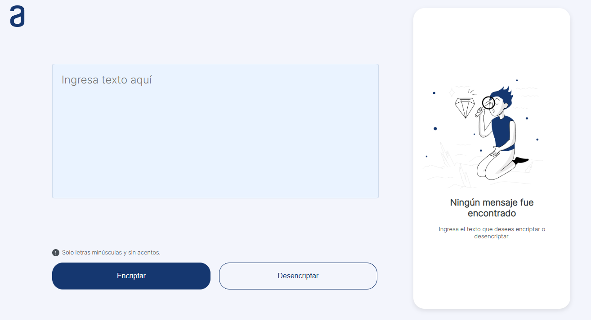

# Project
This text Encryptor was developed as part of the Oracle Next Education program in partnership with Alura Latam.

***

## Overview
The Text Encryptor is a project that allows you to encrypt text by replacing vowels with their corresponding encryption keys. The application features a user-friendly graphical interface that allows you to easily encrypt or decrypt the entered text and copy the obtained result.

***

## Interface


***

## Built with
The project was developed using the following languages:

* HTML5
* CSS3
* JavaScript

***

## How it works

The application encrypts the entered text by replacing the vowels with their corresponding encryption keys. The substitution rules are as follows:

```
The letter "e" is converted to "enter"
The letter "i" is converted to "imes"
The letter "a" is converted to "ai"
The letter "o" is converted to "ober"
The letter "u" is converted to "ufat"
```
It is important to note that the application only works with lowercase letters and does not support accents or special characters.

***

### Usage
The user interface (UI) includes two main buttons, one for encryption and the other for decryption of the entered text. After performing either of these actions, a "Copy" button will appear to allow the user to easily copy the obtained result. Additionally, the application is responsive and can adapt to different screen sizes, ensuring a consistent user experience across devices.

***

## Autor
https://www.linkedin.com/in/santiago-rodr%C3%ADguez-morales-0701161b1/
